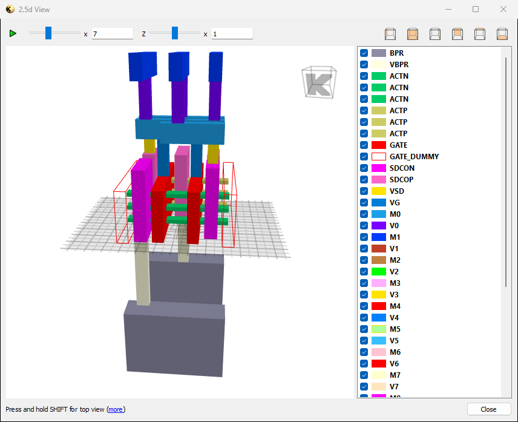

# GT2n_for_KLayout

## KLayout technology files for GT2n nanosheet educational process

Most of the files comes for the official GT2N site : https://github.com/azadnaeemi/GT2N

The GT2n process is also a platform of the OpenROAD-flow-scripts

 * GT2n.lyt   : technology and connections description  
 * GT2n.lyp   : layers color and shape description  
 * drc/GT2n.lydrc : DRC script  
 * lvs/GT2n.lylvs : LVS script  
 * d25/GT2n.lylvs : D25 script
 * gds/gt2_6t_std_cells_w13_svt.gds : GDS layout of a std cell library example

To install it, copy the file **GT2n.lyp**, **GT2n.lyt** and the 3 directories **drc** , **lvs** and **d25** of that repository in your directory :  
`$HOME/.klayout/tech/GT2n  (under Linux)`  
`#HOMEDATA#/klayout/tech/GT2n  (under Windows)`  

Within KLayout, you can then access the technology **GT2n** by the menu : **[Tools]-[Manage Technologies]** 

A 2.5D view of the cell **gt2_6t_nand2_x1_w13_svt**

